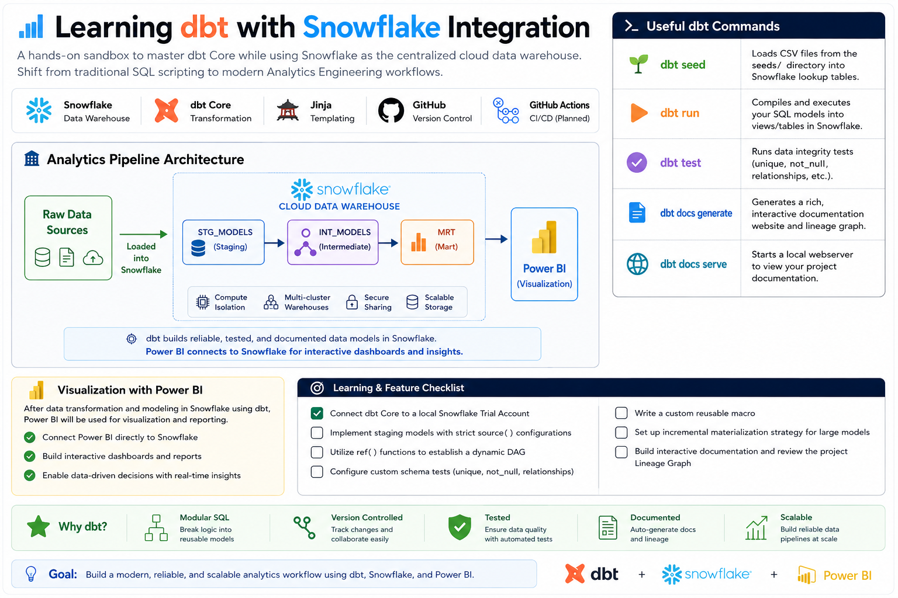

```markdown
# 📊 Learning dbt with Snowflake Integration

Welcome to the **test-learn-dbt** sandbox! This repository is a hands-on laboratory dedicated to mastering **dbt (Data Build Tool) Core** while using **Snowflake** as the centralized cloud data warehouse. 

The goal here is to shift from traditional SQL scripting to modern **Analytics Engineering** workflows—emphasizing modularity, version control, testing, and documentation.

---

## 🗺️ Analytics Pipeline Architecture

```text
  [ Raw Data Sources ] 
          │
          ▼  (Loaded into Snowflake)
 ┌────────────────────────────────────────────────────────┐
 │                   SNOWFLAKE WAREHOUSE                  │
 │                                                        │
 │   ┌──────────────┐      ┌──────────────┐      ┌────┐   │
 │   │  STG_MODELS  │ ──►  │  INT_MODELS  │ ──►  │MRT │   │
 │   │  (Staging)   │      │ (Intermediate│      │(Mar│   │
 │   └──────────────┘      └──────────────┘      └────┘   │
 └────────────────────────────────────────────────────────┘
          │
          ▼
  [ dbt Docs / Lineage Graph ]

```

### 🖼️ Project Visuals

### 🔄 Dynamic Data Lineage (DAG)

dbt automatically tracks how data moves through your Snowflake warehouse. Here is a visualization of how models connect dynamically using `ref()` and `source()` functions:

---

## 🛠️ Tech Stack & Core Concepts

* **Data Warehouse:** `Snowflake` (Compute isolation, multi-cluster warehouses)
* **Transformation Engine:** `dbt Core` (v1.x)
* **Templating & Macros:** `Jinja` + `SQL`
* **Orchestration & CI/CD:** `GitHub Actions` *(Planned)*

---

## 🏃 Useful dbt Commands

Use these daily driving commands to run and test your data platform:

| Command | Purpose |
| --- | --- |
| `dbt seed` | Loads CSV files from the `seeds/` directory into Snowflake lookup tables. |
| `dbt run` | Compiles and executes your SQL models into views/tables inside Snowflake. |
| `dbt test` | Runs data integrity schema and custom assertions (e.g., `unique`, `not_null`). |
| `dbt docs generate` | Generates a rich, interactive documentation website and lineage graph. |
| `dbt docs serve` | Starts a local webserver to view your project documentation. |

---

## 🎯 Learning & Feature Checklist

Track the implementation status of core dbt capabilities in this repository:

* [x] Connect dbt Core to a local Snowflake Trial Account
* [ ] Implement staging models with strict `source()` configurations
* [ ] Utilize `ref()` functions to establish a dynamic DAG (Directed Acyclic Graph)
* [ ] Configure custom schema tests (`unique`, `not_null`, `relationships`)
* [ ] Write a custom reusable macro
* [ ] Set up incremental materialization strategy for large data models
* [ ] Build interactive documentation and review the project Lineage Graph

```

```
